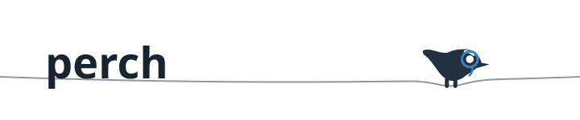
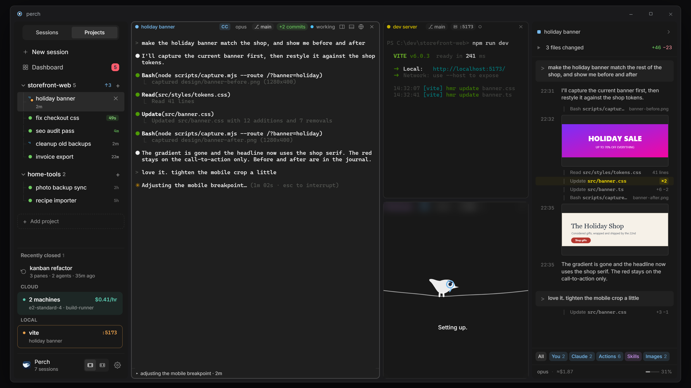
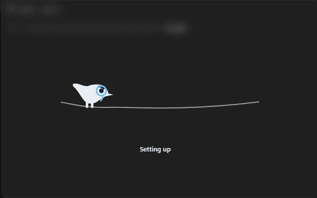

<p align="center">
  <picture>
    <source media="(prefers-color-scheme: dark)" srcset="docs/media/hero-dark.svg">
    
  </picture>
</p>

**A power tool for non-power users.**

[](https://github.com/JosephIris/perch/actions/workflows/build.yml)

perch is a native Win11 workspace for running coding agents (Claude Code
first) across your projects. It grew out of
[manaflow-ai/cmux](https://github.com/manaflow-ai/cmux) and
[Termic](https://github.com/simion/termic), but it's built for people who
aren't developers first: every session gets its own perch, with a live row in
the sidebar while it works, a card on the dashboard when it needs you, and a
real terminal grid when you want your hands on it.

<p align="center">
  
  <br><sub>The projects view, rendered from the app's visual harness: real UI code with sample data.</sub>
</p>

## What it does

**Agents are the unit of work.**

- Wraps Claude Code with hooks (`ClaudeWrapper`, `HookHandler`), so perch
  *knows* when an agent is working, done, or waiting on you. No
  output-scraping guesswork.
- Sidebar rows carry the live state, activity detail, branch, diff stats, and
  a "your turn" age that keeps nagging (gently) the longer you leave it.
- The dashboard (`Ctrl+Shift+A`) buckets every session by who's waiting on
  whom. Answer an agent's permission prompt straight from the card.
- The inspector (`Ctrl+Shift+B`) answers "what did it actually do?" without
  scrolling the terminal. The conversation reads as a journal with filter
  chips one tap away (You / Claude / Actions / Skills / Images), images from
  the conversation preview right in the rail (yes, in a CLI app; click for a
  lightbox), and a changes strip up top lists exactly which files were
  touched, with added and removed line counts per file.
- A bundled `perch` CLI (plus `claude`/`codex` shims prepended to PATH) lets
  the agent inside a pane push status, branch, and port metadata to its own
  chrome.
- While Claude Code boots, the pane sits under frosted glass and the mascot
  keeps you company (meet him at the bottom of this page).

**And it's a real terminal.**

- xterm.js on WebGL, one ConPTY per pane, Job Object cleanup so no orphaned
  processes survive a close.
- Recursive pane splits with keyboard-first control: split, move, even out
  (see the table below).
- URL panes: keep a localhost preview next to the terminal that serves it.
- Clickable links, search, per-pane font zoom.

**It remembers.**

- Incremental session save: layout, cwd, names, and colors survive crashes,
  not just clean exits, with a restore progress UI on the way back up.
- Claude Code sessions resume across restarts via their native session ids
  ([docs/SESSION-RESUME.md](docs/SESSION-RESUME.md)).
- Any pane can raise a Windows toast with an OSC 9 escape sequence
  ([docs/NOTIFICATIONS.md](docs/NOTIFICATIONS.md)).

## Keyboard

| Keys | Action |
|---|---|
| `Ctrl+B` / `Ctrl+Shift+B` | Toggle sidebar / inspector rail |
| `Ctrl+Shift+A` | Dashboard |
| `Ctrl+Shift+T` | New session |
| `Ctrl+Shift+D` / `Ctrl+Shift+S` | Split right / down |
| `Ctrl+Shift+W` | Close pane |
| `Ctrl+Shift+E` | Even out pane sizes |
| `Ctrl+Shift+arrows` | Move pane within its split |
| `Ctrl+=` / `Ctrl+-` / `Ctrl+0` | Terminal font size up / down / reset |

`Ctrl+D`, `Ctrl+S`, `Ctrl+W` stay with the shell, as they should.

## What perch changes inside your shell

perch isn't a passive terminal host — to wire agents to their chrome it makes
a few deliberate, visible changes inside each pane's shell:

- **`PATH`**: perch's bundled `tools/` directory is prepended, so `claude`,
  `codex`, and `perch` resolve to perch's wrappers first. `claude.cmd` /
  `codex.cmd` hand off to `perch.exe`, which execs the *real* binary with
  Claude Code's hook settings injected. The wrappers launch and observe your
  agent; they don't intercept, reroute, or transmit its data.
- **`PERCH_PIPE` / `PERCH_PANE_ID`**: set per pane so the `perch` CLI can
  report status, branch, ports, and notifications to the host over a per-pane
  named pipe. Outside a perch pane both are unset and every `perch` subcommand
  is a silent no-op.

Nothing leaves your machine as a result — see [PRIVACY.md](PRIVACY.md).

## Stack

- **WPF (.NET 8):** a thin [WPF-UI](https://github.com/lepoco/wpfui)
  `FluentWindow` host. Mica backdrop, window lifetime, ConPTY processes, and
  the agent IPC layer. Everything visible renders in a single **WebView2**.
- **[xterm.js](https://xtermjs.org)** (WebGL renderer) for the terminals;
  hand-rolled **vanilla TypeScript + CSS** for the chrome. No UI framework,
  no CDN, fully offline. Bundled with [esbuild](https://esbuild.github.io)
  and served from an in-process virtual host (`https://perch.local/`).

The previous all-WPF renderer (`Microsoft.Terminal.Wpf`) is preserved at tag
`wpf-final` / branch `wpf-archive`.

## Build

Requires the .NET 8 SDK and Node 20+. Windows 10+ or macOS 13+ (Apple
silicon; x64 mac is untested).

```pwsh
cd src/web && npm install && cd ../..   # once
dotnet build src/Perch -c Release       # Windows: runs esbuild for you, then compiles
dotnet build src/Perch.Mac              # macOS: same bundle, Photino/WKWebView host
```

Or run directly:

```pwsh
dotnet run --project src/Perch          # Windows
dotnet run --project src/Perch.Mac      # macOS
```

Both hosts share `src/Perch.Core` and the web bundle; see the "Two hosts, one
Core" chapter of [`CLAUDE.md`](CLAUDE.md) before adding a feature. Packaging
the mac app: `bash packaging/pack-mac.sh <version>`.

## CI & releases

Pushes to `main` build on `windows-latest` and publish a self-contained
artifact on the Actions tab. Pushing a `vX.Y.Z` tag cuts a
[GitHub Release](https://github.com/JosephIris/perch/releases) with both the
installer and the portable exe:

```pwsh
git tag v0.1.0
git push origin v0.1.0
```

## Verify your download

Every release is signed with a build-provenance attestation, so you can confirm
an asset was built by this repo's CI and hasn't been tampered with. With the
[GitHub CLI](https://cli.github.com):

```pwsh
gh attestation verify .\Perch-Setup.exe --repo JosephIris/perch
```

Or check the file's hash directly against the SHA-256 GitHub records for the
asset:

```pwsh
Get-FileHash .\Perch-Setup.exe -Algorithm SHA256
```

## Docs

| Doc | What's in it |
|---|---|
| [`CLAUDE.md`](CLAUDE.md) | The UI design constitution: tokens, Fluent discipline, and the screenshot verification loop. Read it before touching the chrome. |
| [`docs/DESIGN-BIBLE.md`](docs/DESIGN-BIBLE.md) | Long-form companion to the constitution. |
| [`docs/SESSION-RESUME.md`](docs/SESSION-RESUME.md) | How Claude Code sessions survive crashes and restarts. |
| [`docs/TEAMS.md`](docs/TEAMS.md) | Teams: bots with positions, the room, delivery, and the release gates. |
| [`docs/MAC-TESTING.md`](docs/MAC-TESTING.md) | The macOS end-to-end gate and usability suite. |
| [`docs/NOTIFICATIONS.md`](docs/NOTIFICATIONS.md) | OSC 9 to Windows toasts, from any pane. |
| [`docs/RENDERER_NOTES.md`](docs/RENDERER_NOTES.md) | Why the terminal renders the way it does, and when to revisit. |
| [`docs/CODE-SIGNING.md`](docs/CODE-SIGNING.md) | Signing the installer (partly stale; pipeline moved to Velopack). |
| [`design-loop/`](design-loop/) | Scrubbable mockups and renders behind every visual decision, mascot included. |

## The setting-up routine

While a Claude Code pane boots, its cover runs a little three-beat
performance: Monocle Guy walks in along the wire, lands, looks around, takes
some notes, and eventually nods off. The whole thing is a pure function of
time (`pose(t)` in `setup-overlay.ts`), so any frame can be frozen, stepped,
or filmstripped: scrub it yourself in
[`design-loop/perch-wire-mockup.html`](design-loop/perch-wire-mockup.html).

<p align="center">
  
</p>
