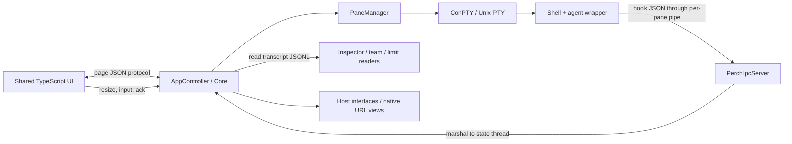

# Perch codebase context

Recorded 2026-09-06 against `94a52f1`, then updated for the review fixes. This is an orientation and maintenance
guide; the [dated review](reviews/2026-09-06.md) holds defects and measurements.
Team orchestration has a separate [follow-up review](reviews/2026-09-06-team-room.md)
covering message correlation, cross-project identity, retries, and persistence.
Read the [implementation follow-up](reviews/2026-09-06-fixes.md) for current
fixes, tests, approval blocks, and live checks; dated findings are historical.

## What the product actually is

Perch is a native desktop workspace for terminal-based coding agents. Windows
uses WPF/WebView2/ConPTY; macOS uses Photino/WKWebView/Unix PTYs. Both render the
same web UI and share Core. Projects group sessions; sessions contain recursive
pane trees. A leaf can be a terminal, a native browser pane, or a board.

Claude and Codex both have wrapper/hook and transcript integrations. The team
room's orchestration is specifically Claude-oriented: its host callbacks create
Claude tabs, type into Claude, and read Claude transcripts. Codex terminal support
does not imply Codex team-bot parity.

Existing features include lazy session startup, agent resume, dormant sessions,
worktrees, projects, dashboard, Inspector journal/images/change lists, team room
and tasks, artifact boards, model selection, loopback-server discovery, GCP
resource discovery, and Velopack update adapters. Neither `README.md` nor the old
parity table fully captures this scope.

## Code map

| Area | Entry points and responsibility |
|---|---|
| Windows startup | `src/Perch/App.xaml.cs`, `MainWindow.xaml.cs`: environment, instance ownership, native host adapters, window lifetime |
| macOS startup | `src/Perch.Mac/Program.cs`, `MacHost.cs`, `AppDispatcher.cs`: native window, managed state thread, bridge, lifecycle |
| Core coordinator | `AppController.cs`: bridge router, sessions, resume/spawn, status, setup covers, Git refresh, settings, shutdown |
| Host contracts | `Hosting.cs`, `UiThread.cs`, `Pty.cs`, `SystemProbeTypes.cs` |
| Session model | `Session.cs`, `SessionStore.cs`, `PaneTree.cs`, `StateProjection.cs` |
| Projects/worktrees | `Project.cs`, `Worktree.cs`, `GitProc.cs`, `RepoWatcher.cs` |
| Terminal/process lifetime | `PaneManager.cs`, ordered `QueuedPty.cs`, fair `PaneOutputBatcher.cs`; Windows `ConPty.cs`, `PaneJob.cs`, `JobObjectGuard.cs`; mac `UnixPty.cs`, `PtyOrphans.cs` |
| Reclamation | `IdleReaper.cs` judges sessions; `JobSweep.cs` handles leftover process scopes |
| Agent integration | `tools/perch-cli/{ClaudeWrapper,CodexWrapper,HookHandler,BinResolver}.cs`; per-pane `PerchIpc.cs` |
| Transcripts | `TranscriptService.cs` owns background readers; `TranscriptLines.cs` streams JSONL; `TranscriptReader.cs`, `CodexTranscriptReader.cs` and locator helpers; `ModelLimitWatch.cs`, `UsageService.cs` |
| Teams | `TeamController.cs` orchestration; `TeamStore.cs`, `Team.cs`, `TeamTasks.cs`, `RoomLedger.cs`, `TeamRender.cs`, `TeamMarkers.cs` |
| Boards | `BoardController.cs`, `BoardStore.cs`, `BoardPaths.cs`; separate from team task cards |
| Resource panels | `LocalController/LocalPoller/LocalLedger`; `CloudController/CloudPoller/CloudLedger/CloudPriceCatalog` |
| Web composition | `src/web/src/main.ts` wires modules; `bridge.ts` defines transport and DTOs |
| Terminal UI | `workspace.ts` owns per-session stages; `pane.ts` owns xterm; `sync-output.ts` batches synchronized frames |
| Other UI | `sidebar.ts`, `dashboard.ts`, `inspector.ts`, `team-room.ts`, `board-pane.ts`, `settings.ts` |
| Styling | `tokens.css`, `style.css`; bundled Inter and Geist Mono under `src/web/fonts` |
| Native URL views | Core `UrlPanes.cs`; Windows `UrlPaneHost.cs`/`UrlPaneController.cs`; mac `MacUrlPanes.cs`/`MacNavDelegate.cs` |
| Automation | `ControlIpcServer.cs`; `scripts/ctl.mjs`, CDP helpers, OS-specific integration scripts |

## Runtime flows and invariants

1. Startup loads settings, sessions, and projects, establishes controllers, and
   arms eligible saved conversations. Arming resume is not spawning an agent.
2. A selected tab is laid out by the page. Its first `pane.resize` triggers lazy
   PTY spawn; `Shell.BuildStartupCommandLine` sets cwd, tools PATH, and per-pane
   environment. Team delivery can explicitly start an unopened bot without layout.
3. PTY bytes are posted to the page as base64. xterm consumes them and emits
   `pane.ack`; both PTY implementations use 256 KiB/64 KiB high/low watermarks.
   Every live producer needs a consumer even if its tab has never been opened.
   `PaneOutputBatcher` coalesces output with a 64 KiB per-pane slice and an
   aggregate dispatcher budget; exit notifications follow queued output.
   Input uses a separate protocol: `pane.ready` releases cold input, the page
   sends at most 16 KiB until `pane.in.ack` confirms native write completion.
   Sequence and input-instance IDs reject stale acknowledgements after restore.
   `QueuedPty` serializes keyboard, paste and team writes off the UI thread;
   non-page producers have a 16 MiB queue budget with explicit failure reporting.
4. Wrappers locate the real agent while excluding Perch's tools directories.
   Hooks send typed IPC; `PaneManager` forwards subscribed events to Core.
   State changes project back to the web UI. The watchdog and terminal probes
   reconcile missing hook events, so inferred state is deliberately separate.
5. Closing archives a session (ten recently closed entries maximum); sleeping
   keeps its tab. PTY cleanup uses existing graceful-exit/resume machinery.
   A session's native PTY, web terminal, native browser, and caches have distinct
   lifetimes: changing a session flag does not automatically dispose all of them.
6. Team sends must be acknowledged by the agent's prompt-submit hook. A successful
   PTY write is not proof of delivery. Preserve parked/held/failed states and
   avoid blind retries that could duplicate a submitted prompt.

Sleeping terminals now wait for PTY exit and drained output, serialize their
buffers, and release xterm/DOM/addon instances. Ordinary tab switching still
retains live terminals and only disposes their WebGL renderer. Wake restores
normal and alternate-screen contents into history before the new shell paints
its startup screen. Snapshots are in-memory, not a new persistence contract;
an application restart still uses the existing session/agent resume behavior.
The fit, WebGL and serialize addon versions are pinned for xterm 5.5 compatibility.

Inspector requests carry a request ID and the last revision held by the page.
Responses either replace the journal or carry an event suffix and its base
revision. A missing base triggers a full fetch; stale requests cannot overwrite
a newer response. Unchanged journal rows keep their DOM nodes. Transcript reads
run on per-conversation workers, stream complete rows, and reuse unchanged
immutable projections. Reloadable caches are capped and evicted for sleeping
panes; a recently requested team snapshot stays through the next room poll to
preserve final replies. Model discovery asynchronously re-evaluates team limits.

Core mutates state on `IUiThread`. On Windows that wraps WPF's dispatcher; on
macOS it is a managed thread with a synchronization context. Native AppKit work
still needs the Photino/main-thread adapter. Snapshot state before background
work, and validate pane/session identity and request generation on completion.

The normal agent pipe and optional control pipe are distinct. The control pipe
is disabled unless `PERCH_ENABLE_TEST_IPC` is nonempty. Its name is global to the
user's local harness environment, not derived from `PERCH_DATA_DIR`.

## Storage and isolation

| Data | Location / semantics |
|---|---|
| User state | `<AppPaths.DataRoot>/perch/`: sessions, settings, projects, ledgers, errors log; root uses `PERCH_DATA_DIR`, else .NET ApplicationData |
| WebView2 profile | Host-managed profile under Perch data; isolate it along with sessions for GUI runs |
| Worktrees | Settings override or LocalApplicationData/`Perch/worktrees`; `PERCH_DATA_DIR` also overrides default base |
| Claude transcripts | `CLAUDE_CONFIG_DIR` or `~/.claude`, then `projects`; locator has cwd-scoped and recursive fallback paths |
| Codex transcripts/models | `CODEX_HOME` or `~/.codex`; `CodexTranscripts` and `CodexModels` read these |
| Codex hooks profile | Wrapper writes `perch.config.toml` in Codex home; generated hook trust may also live there |
| Pane marker files | Temp files keyed by pane ID: model, peer name, board/team context; see respective helper classes |
| Team shared data | Main checkout `.perch/team/`: team, positions, briefs, bot memories, tasks |
| Team machine-local data | `.perch/team/local/`: tab bindings, room JSONL, rendered prompts/roster, artifacts |
| Boards | `.perch` board folders; `board.md` has an authoritative JSON layout comment and generated prose |
| Build outputs | `src/Perch/wwwroot`, `bin`, `obj`; generated and ignored |

`AtomicFile` already implements sibling-temp replacement. Board/team stores
protect unreadable data against writes; global stores do not yet consistently
follow that policy. Do not assume all persistence has equal crash protection.

Worktree seed directories are shared links/junctions, while small files are
copied. Dependency installs inside a seeded tree affect the linked source
directory. Team state intentionally lives in the main checkout even when a bot
works in another tree. Worktree removal preserves the branch and unlinks seeded
directories before asking Git to remove the checkout.

## Development and verification

Use the commands in [AGENTS.md](../AGENTS.md). `scripts/build.ps1` is the reliable
Windows entry point: typecheck, bundle, then compile/copy. For a fresh checkout,
bundle before the host project is evaluated, because its content glob otherwise
misses a not-yet-created `wwwroot` directory. CI and mac packaging explicitly do
this; a bare first `dotnet build` is not equivalent.

The web test runner bundles `test/*.test.ts` with esbuild and runs Node tests.
It does not typecheck; run `npm run typecheck` separately. The C# test project
targets both `net8.0` and `net8.0-windows`; the latter includes Windows job tests.
Most tests are pure/model/helper tests, not full host/page orchestration.

For a new lifecycle feature, cover delayed completion, close while starting,
sleep/wake, background tabs, stale events, and browser reload. For a new poller,
measure its actual caller with `ProcRunner.BeginScope`; not every native helper
currently routes process launches through that counter.

Native end-to-end gates are documented in `CLAUDE.md`, `docs/TEAMS.md`, and
`docs/MAC-TESTING.md`. They use real agents and cannot be inferred from unit-test
success. Older test harnesses have varying isolation quality; inspect them first.

## Existing resource controls worth preserving

- Lazy PTYs, bounded PTY backpressure, synchronized-output batching.
- Session idle policy and process-scope cleanup that distinguishes serving ports.
- Cached Git status, file-event invalidation, subprocess counting tests.
- Local polling at 30 seconds closed / 3 seconds open; cloud at 5 minutes /
  60 seconds once available; usage requests have backoff.
- Inspector polling only for a working agent; delayed skeletons and request
  coalescing. Transcript readers tail appended data; image bytes load on demand.
- Bounded log rotation. No runtime CDN dependencies.

The implementation follow-up records cache/lifecycle fixes and their validation.
The original review remains useful for understanding the reproductions.

## Guidance and documentation debt

- `CLAUDE.md` starts with the right host split, then retains retired XAML,
  TerminalControl, typography, and Mica-specific guidance. Current tokens and
  shared web components are the implementation reference for new UI work.
- `docs/PARITY.md` incorrectly lists several shipped features as absent. Its
  upstream column is explicitly unverified; do not use it to infer current
  upstream capabilities.
- Search is the Inspector journal's search; unused xterm search/web-links addons
  have been removed. Font size and font family now reach xterm through prefs.
- Team delivery uses `local/outbox.json`, independent of room-history rotation.
  Only a matching submit sequence confirms receipt. One line may await submit
  per session; the rest are queued. A restarted unknown submission is not
  automatically retyped. Use the preserved payload for an explicit retry.
- Some comments promise timers, atomicity, cache coverage, or zero subprocess
  cost that the actual call paths do not provide. Preserve rationale, but verify
  claims with code and focused tests when changing the associated subsystem.
